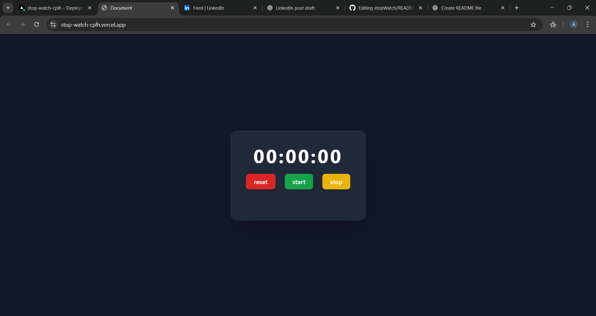

# ⏱️ Stopwatch Project

A clean, modern, and fully functional **Stopwatch Application** built with **HTML, Tailwind CSS, and JavaScript**.  
It supports start, stop, reset, millisecond accuracy, and previous-record saving — all inside a smooth UI.

---

## 🔗 Live Demo  
👉 **https://stop-watch-cplh.vercel.app/**

---

## 📸 Preview  



---

## 🌟 Features

- 🟢 **Start**, 🟡 **Stop**, 🔴 **Reset** controls  
- ⏱️ Millisecond-precision timing  
- 📝 Automatically saves each stopped timing  
- 🧹 Reset clears timer + saved history  
- 🎨 Tailwind CSS styling  
- 📱 Fully responsive layout  
- ⚡ Smooth updates using 10ms intervals  

---

## 🛠️ Tech Stack

- **HTML5** — Structure  
- **Tailwind CSS** — Styling  
- **JavaScript** — Timer logic  

---

## 📁 Project Structure

stopWatch/
│── index.html
│── README.md

yaml
Copy code

---

## 🔧 How It Works

### 🏃 Start Timer
```js
timerId = setInterval(startTimer, 10);
✋ Stop Timer + Save Time
js
Copy code
clearInterval(timerId);
timerId = null;
progressSave(timerDisplay.innerText);
🔁 Reset Everything
js
Copy code
clearProgressSave();
timerDisplay.innerHTML = "00:00:00";
⏱️ Timer Logic (Runs every 10ms)
js
Copy code
millisecond++;
if (millisecond == 100) {
    millisecond = 0;
    second++;
    if (second == 60) {
        second = 0;
        minute++;
    }
}
🚀 Getting Started
1️⃣ Clone this repository
bash
Copy code
git clone https://github.com/abeerpathela/stopWatch.git
2️⃣ Open the folder
bash
Copy code
cd stopWatch
3️⃣ Run the project
Open index.html in any browser.

🤝 Contributing
Feel free to open issues or submit PRs!

👨‍💻 Author
Made with ❤️ by Abeer Pathela

yaml
Copy code

---

If you’d like, I can also add:

✔️ Screenshot section  
✔️ Badges  
✔️ GIF preview demo  
✔️ Feature icons  

Just tell me!